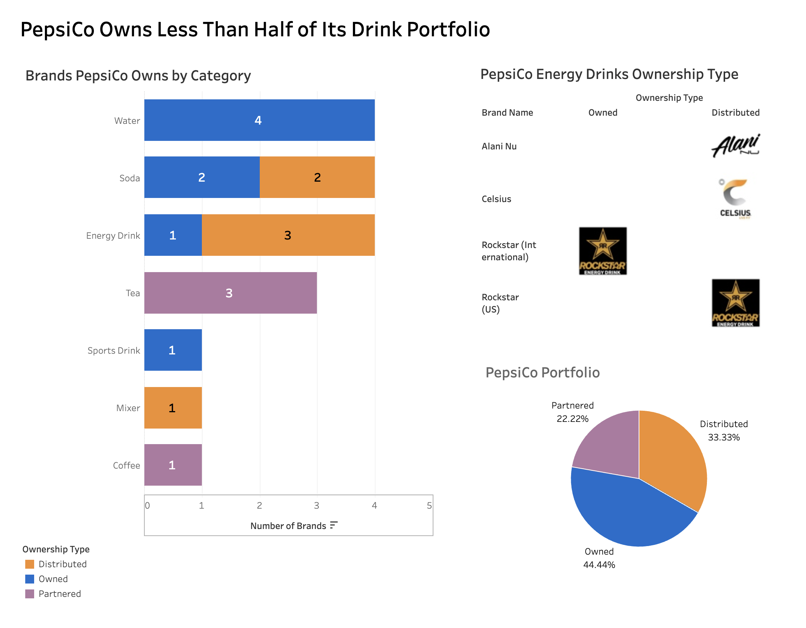

# PepsiCo Owns Less Than Half of Its Drink Portfolio

A Tableau dashboard analyzing which beverage brands PepsiCo actually owns, distributes, and partners on.

## Files
- `dashboard.png` — final dashboard preview
- `pepsico_beverages_clean.csv` — source data used in Tableau
- `Pepsi Brands.twbx` — Tableau workbook

## Tools Used
- Tableau Public
- CSV
- GitHub

## Key Takeaway
PepsiCo owns less than half of the drink portfolio shown in this project. A large share of the portfolio is controlled through distribution agreements and partnerships.

## Blog Post
[Read the related post on Mont Animation Studio](PASTE-YOUR-LINK-HERE)
